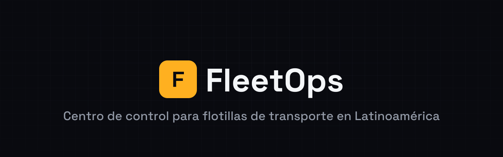
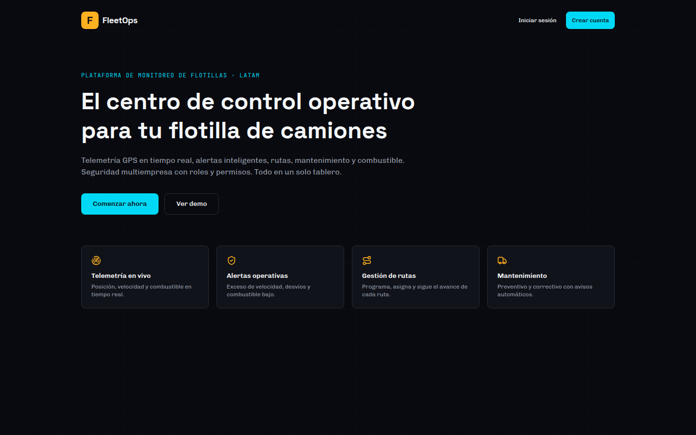
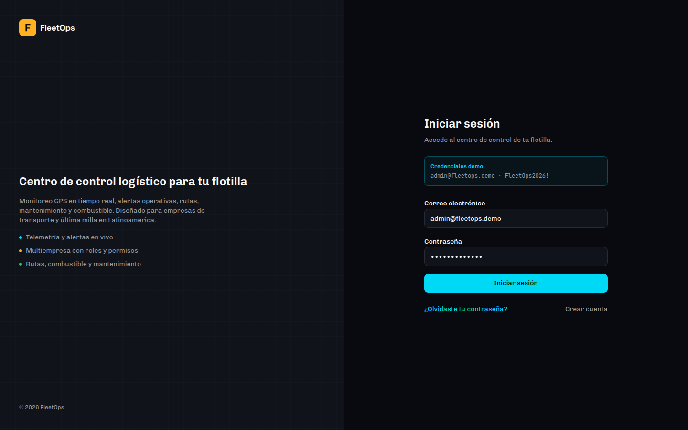

<div align="center">



<br />

<p>
  <strong>Centro de control operativo para flotillas de transporte en Latinoamérica.</strong><br />
  Telemetría GPS en tiempo real, alertas automáticas, rutas, mantenimiento y combustible — en un solo tablero.
</p>

<p>
  
  
  
  
  
  
  
</p>

<p>
  <a href="#-características">Características</a> ·
  <a href="#-capturas">Capturas</a> ·
  <a href="#-stack">Stack</a> ·
  <a href="#-inicio-rápido">Inicio rápido</a> ·
  <a href="#-documentación">Documentación</a> ·
  <a href="#-pruebas">Pruebas</a> ·
  <a href="#-despliegue">Despliegue</a>
</p>

</div>

---

## 📋 Índice

- [Características](#-características)
- [Capturas](#-capturas)
- [Stack](#-stack)
- [Inicio rápido](#-inicio-rápido)
- [Variables de entorno](#-variables-de-entorno)
- [Estructura del proyecto](#-estructura-del-proyecto)
- [Documentación](#-documentación)
- [Pruebas](#-pruebas)
- [Despliegue](#-despliegue)
- [Solución de problemas](#-solución-de-problemas)
- [Marca](#-marca)
- [Roadmap](#-roadmap)

---

## ✨ Características

**Operación**
- 🗺️ Mapa en vivo con marcadores por unidad, rumbo, clustering y trazado de ruta
- 📡 Ingestión de telemetría GPS real vía API con autenticación por dispositivo
- 🔔 Motor de alertas automático: exceso de velocidad, combustible bajo, desvío de ruta, GPS desconectado, retraso, mantenimiento próximo
- 🛣️ Ciclo de vida de rutas completo (programar → iniciar → pausar → reanudar → completar/cancelar) con reglas de negocio
- ⚡ Actualizaciones en tiempo real (Supabase Realtime) sin recargar la página

**Gestión**
- 🚚 Flota, 👤 conductores, 🔧 mantenimiento, ⛽ combustible con cálculo de rendimiento
- 📊 Analítica con filtros de fecha sobre datos reales (Recharts)
- 🎮 Simulador GPS visual para demos, con persistencia opcional para pruebas end-to-end

**Plataforma**
- 🏢 Multiempresa real: organizaciones, membresías, 5 roles, Row Level Security en Postgres
- 🔐 Autenticación completa (registro, login, recuperación de contraseña) con cookies seguras
- 🔑 API keys de dispositivo con hash SHA-256, nunca en texto plano
- 🇲🇽 Interfaz 100% en español de México · moneda MXN · sistema métrico

---

## 📸 Capturas

<table>
<tr>
<td width="50%">

**Landing**


</td>
<td width="50%">

**Inicio de sesión**


</td>
</tr>
</table>

---

## 🧱 Stack

| Capa | Tecnología |
|---|---|
| Framework | [Next.js 16](https://nextjs.org) (App Router, Turbopack), [React 19](https://react.dev), TypeScript estricto |
| UI | [Tailwind CSS v4](https://tailwindcss.com), componentes propios sobre [Radix UI](https://radix-ui.com), [Lucide Icons](https://lucide.dev) |
| Formularios | [React Hook Form](https://react-hook-form.com) + [Zod](https://zod.dev) |
| Datos en cliente | [TanStack Query](https://tanstack.com/query) + [TanStack Table](https://tanstack.com/table) |
| Gráficas | [Recharts](https://recharts.org) |
| Mapas | [React Leaflet](https://react-leaflet.js.org) + OpenStreetMap + tiles CARTO Dark Matter |
| Backend de datos | [Supabase](https://supabase.com) — PostgreSQL, Auth, Realtime, RLS |
| Notificaciones | [Sonner](https://sonner.emilkowal.ski) |
| Calidad | ESLint 9 (flat config), Prettier, [Vitest](https://vitest.dev) + Testing Library, [Playwright](https://playwright.dev) |
| Despliegue | [Vercel](https://vercel.com) (app) + Supabase Cloud (datos/auth/realtime) |

---

## 🚀 Inicio rápido

**Requisitos**: Node.js ≥ 20.11 · pnpm ≥ 10 · un proyecto [Supabase](https://supabase.com) (cloud o local con Docker)

```bash
# 1. Instala dependencias
pnpm install

# 2. Configura variables de entorno
cp .env.example .env.local
# completa NEXT_PUBLIC_SUPABASE_URL, NEXT_PUBLIC_SUPABASE_ANON_KEY,
# SUPABASE_SERVICE_ROLE_KEY (ver sección de variables más abajo)

# 3. Levanta Supabase y aplica las migraciones
npx supabase start        # o usa un proyecto Supabase Cloud + `supabase link`
npx supabase db reset     # aplica supabase/migrations/*.sql

# 4. Crea datos de demostración (idempotente)
pnpm seed

# 5. Arranca el servidor de desarrollo
pnpm dev
```

Abre [http://localhost:3000](http://localhost:3000). Credenciales demo
(solo si `NEXT_PUBLIC_DEMO_MODE=true`): `admin@fleetops.demo` /
`FleetOps2026!`.

> [!NOTE]
> Este repositorio se desarrolló en un entorno sandbox donde las
> descargas de imágenes de Docker Hub estaban bloqueadas por política de
> red, así que las migraciones, el seed y las pruebas de integración/E2E
> **no se ejecutaron contra una instancia real de Supabase** en esa
> sesión — sí se ejecutaron y pasaron las 133 pruebas unitarias, el build
> completo, el lint y el type-check. Ver [`TESTING.md`](./TESTING.md)
> para el detalle exacto de qué se verificó.

Otros comandos útiles:

```bash
pnpm build && pnpm start   # build de producción
pnpm test                  # pruebas unitarias + integración (Vitest)
pnpm lint                  # ESLint
pnpm typecheck              # tsc --noEmit
pnpm format                 # Prettier
```

---

## 🔑 Variables de entorno

Ver [`.env.example`](./.env.example) para la lista completa comentada.

<details>
<summary><strong>Públicas</strong> (expuestas al navegador, prefijo <code>NEXT_PUBLIC_*</code>)</summary>

| Variable | Descripción |
|---|---|
| `NEXT_PUBLIC_APP_NAME` | Nombre de la app mostrado en la UI |
| `NEXT_PUBLIC_APP_URL` | URL base de la app (usada en emails de auth) |
| `NEXT_PUBLIC_SUPABASE_URL` | URL del proyecto Supabase |
| `NEXT_PUBLIC_SUPABASE_ANON_KEY` | Clave anónima (pública) de Supabase |
| `NEXT_PUBLIC_DEMO_MODE` | Muestra credenciales demo en `/login` |
| `NEXT_PUBLIC_ENABLE_GPS_SIMULATOR` | Activa el simulador GPS visual |

</details>

<details>
<summary><strong>Privadas</strong> (solo servidor — nunca con prefijo <code>NEXT_PUBLIC_</code>)</summary>

| Variable | Descripción |
|---|---|
| `SUPABASE_SERVICE_ROLE_KEY` | Clave de servicio — omite RLS, solo servidor |
| `SIMULATOR_SECRET` | Secreto para `POST /api/simulator/tick` |
| `TELEMETRY_RATE_LIMIT_MAX` | Máximo de solicitudes de telemetría por unidad en la ventana |
| `TELEMETRY_RATE_LIMIT_WINDOW_SECONDS` | Ventana de tiempo del rate limit |
| `DEMO_USER_EMAIL` / `DEMO_USER_PASSWORD` | Solo usadas por `pnpm seed` |

</details>

---

## 🗂️ Estructura del proyecto

```
src/
├── app/                  # Next.js App Router
│   ├── (auth)/           # login, registro, recuperación de contraseña
│   ├── (dashboard)/      # flota, conductores, rutas, alertas, mantenimiento,
│   │                     # combustible, analítica, configuración
│   └── api/               # telemetry/ingest, simulator/tick, health
├── components/            # UI, layout, mapas, marca, formularios
├── features/               # queries + Server Actions por dominio
├── lib/
│   ├── geo/               # Haversine, interpolación, desviación de ruta
│   ├── telemetry/          # motor de alertas, núcleo del simulador
│   ├── routes/              # máquina de estados de rutas
│   ├── permissions/          # matriz de roles centralizada
│   └── supabase/              # clientes browser/server/admin/proxy
├── hooks/                      # hooks de Supabase Realtime
└── types/                       # tipos de dominio y de la base de datos

supabase/migrations/    # esquema, RLS, triggers y Realtime (SQL versionado)
scripts/seed.ts          # datos de demostración vía Supabase Admin API
tests/                     # unit · integration · e2e
public/brand/                # isotipo, logotipo y banner (ver Marca)
```

---

## 📚 Documentación

| Documento | Contenido |
|---|---|
| [`ARCHITECTURE.md`](./ARCHITECTURE.md) | Arquitectura general, flujo de auth, modelo multi-tenant, flujo GPS, decisiones técnicas |
| [`DATABASE.md`](./DATABASE.md) | Tablas, relaciones, índices, políticas RLS, funciones SQL, estrategia de migraciones |
| [`API.md`](./API.md) | Endpoints, autenticación de dispositivos, rate limiting, ejemplos |
| [`TESTING.md`](./TESTING.md) | Estrategia de pruebas y qué se verificó realmente en este repo |
| [`PRD.md`](./PRD.md) | Problema, usuarios, propuesta de valor, requisitos, roadmap |

---

## 🧪 Pruebas

```bash
pnpm test              # 133 pruebas unitarias — ejecutadas y pasando
pnpm test:integration  # 33 pruebas de integración — requieren Supabase real
pnpm test:e2e          # 19 escenarios E2E (Playwright) — requieren app + Supabase real
```

Las pruebas de integración y E2E están completas y verificadas
estructuralmente (compilan, y se saltan limpiamente sin credenciales),
pero no se ejecutaron contra un backend real en el entorno donde se
generó este proyecto — ver [`TESTING.md`](./TESTING.md) para el detalle
honesto de qué corrió y qué falta verificar en tu entorno.

---

## 🚢 Despliegue

1. **Supabase Cloud**: crea el proyecto → `supabase link` → `supabase db push` para aplicar las migraciones.
2. **Vercel**: importa el repositorio → configura las variables de entorno (marca `SUPABASE_SERVICE_ROLE_KEY` y `SIMULATOR_SECRET` como secretas) → despliega.
3. En Supabase, agrega la URL de producción a *Redirect URLs* en la configuración de Auth.

Detalle completo en [`ARCHITECTURE.md`](./ARCHITECTURE.md#despliegue).

---

## 🛠️ Solución de problemas

<details>
<summary>El dashboard redirige a <code>/login</code> en bucle</summary>

Revisa que `NEXT_PUBLIC_SUPABASE_URL` y `NEXT_PUBLIC_SUPABASE_ANON_KEY`
sean correctos y que el proyecto de Supabase esté accesible.
</details>

<details>
<summary>El dashboard carga vacío (sin unidades/alertas)</summary>

Ejecuta `pnpm seed` o crea datos manualmente desde la UI.
</details>

<details>
<summary>El mapa no aparece</summary>

React Leaflet requiere `window`; el componente ya se carga con
`next/dynamic` y `ssr: false`. Si ves un error de hidratación, verifica
que no lo estés importando desde un Server Component directamente.
</details>

<details>
<summary><code>POST /api/telemetry/ingest</code> devuelve 401</summary>

Confirma que envías `Authorization: Bearer <api_key>` (nunca como query
param) con una API key activa creada desde Configuración → API y
dispositivos.
</details>

<details>
<summary><code>POST /api/simulator/tick</code> devuelve 403</summary>

Solo funciona fuera de producción, con
`NEXT_PUBLIC_ENABLE_GPS_SIMULATOR=true` y el header
`Authorization: Bearer <SIMULATOR_SECRET>` correcto.
</details>

<details>
<summary>Error de tipos con <code>@react-leaflet/core</code></summary>

El proyecto incluye un parche (`patches/@react-leaflet__core@3.0.0.patch`,
aplicado automáticamente por pnpm) y un shim de tipos
(`src/types/react-leaflet-shims.d.ts`) para un defecto de empaquetado
conocido en `react-leaflet@5.0.0`. Si ves este error de todos modos,
ejecuta `pnpm install` de nuevo para asegurar que el parche se aplicó.
</details>

<details>
<summary>No tengo Docker / no puedo levantar Supabase local</summary>

Usa un proyecto Supabase Cloud gratuito en su lugar; el flujo de
migraciones y seed es idéntico.
</details>

---

## 🎨 Marca


| Activo | Archivo |
|---|---|
| Isotipo (ícono solo) | [`public/brand/isotipo.svg`](./public/brand/isotipo.svg) |
| Logotipo (fondo oscuro) | [`public/brand/logo-dark-bg.svg`](./public/brand/logo-dark-bg.svg) |
| Logotipo (fondo claro) | [`public/brand/logo-light-bg.svg`](./public/brand/logo-light-bg.svg) |

El isotipo usa el glifo **F** de [Chakra Petch](https://fonts.google.com/specimen/Chakra+Petch)
Bold; el wordmark usa [Space Grotesk](https://fonts.google.com/specimen/Space+Grotesk),
la fuente de marca de la app (`--font-brand`), reservada para el
logotipo y los encabezados hero — distinta de Chivo (texto de interfaz)
y JetBrains Mono (telemetría, placas, coordenadas). Detalle completo en
[`public/brand/README.md`](./public/brand/README.md).

**Paleta**

<p>
 Fondo
 Ámbar operativo
 Cian telemetría
 Verde correcto
 Rojo crítico
</p>

---

## 🌎 Roadmap

App móvil para conductores · integración con proveedores GPS/OBD/IoT ·
Directions API y optimización de rutas · mantenimiento predictivo ·
notificaciones push/WhatsApp · portal de clientes con tracking público ·
planes de suscripción. Detalle completo en
[`PRD.md`](./PRD.md#roadmap-futuro).

---

<div align="center">

<br />
<sub>FleetOps · Hecho para la operación logística de Latinoamérica</sub>
</div>
